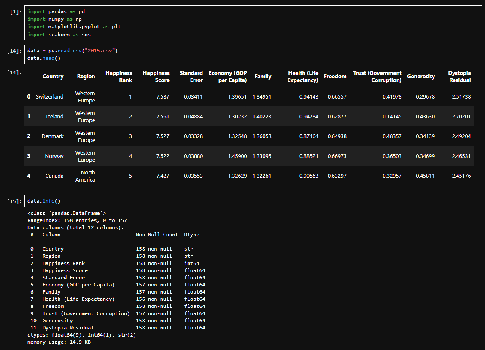
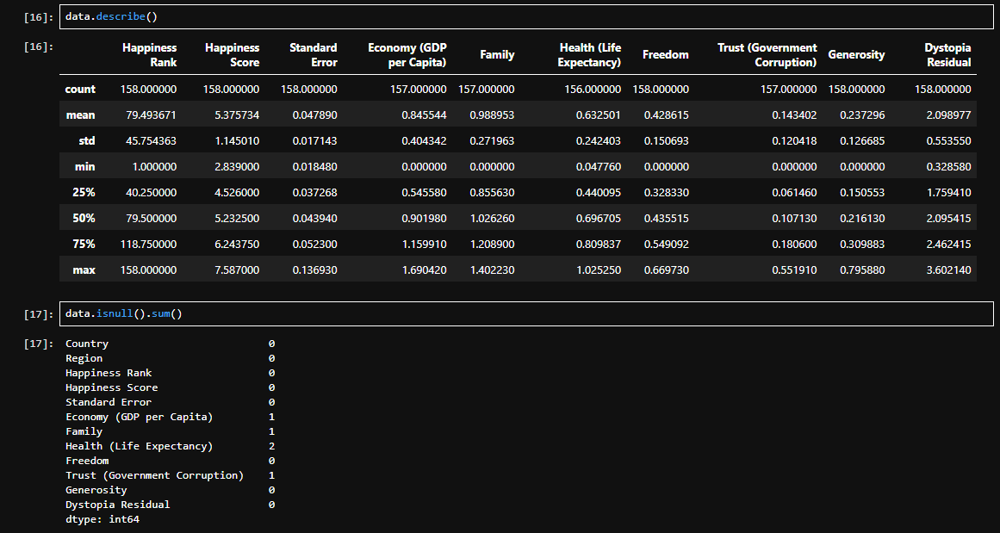
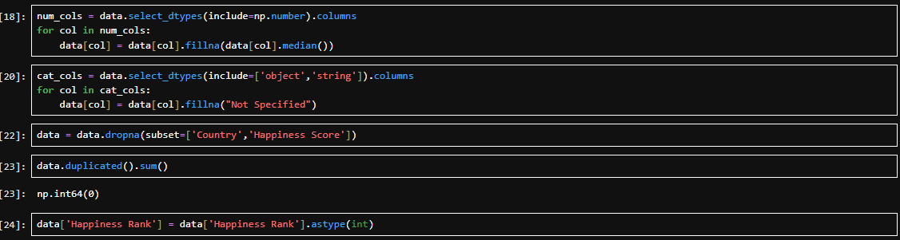
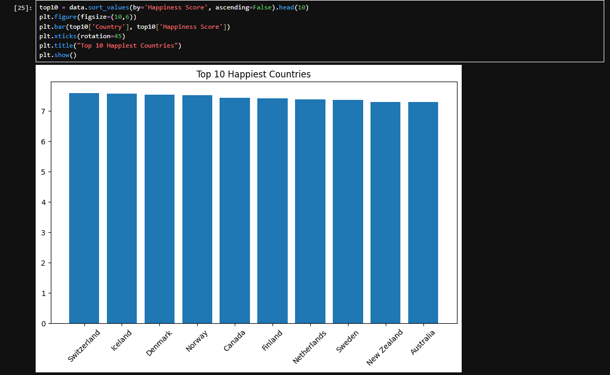
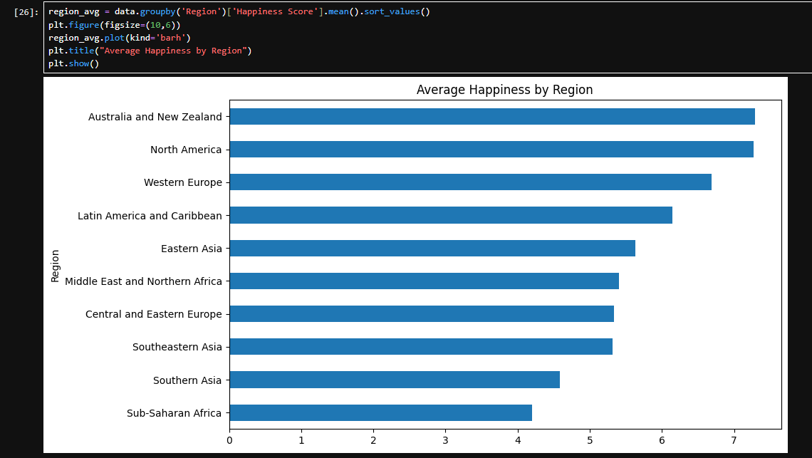
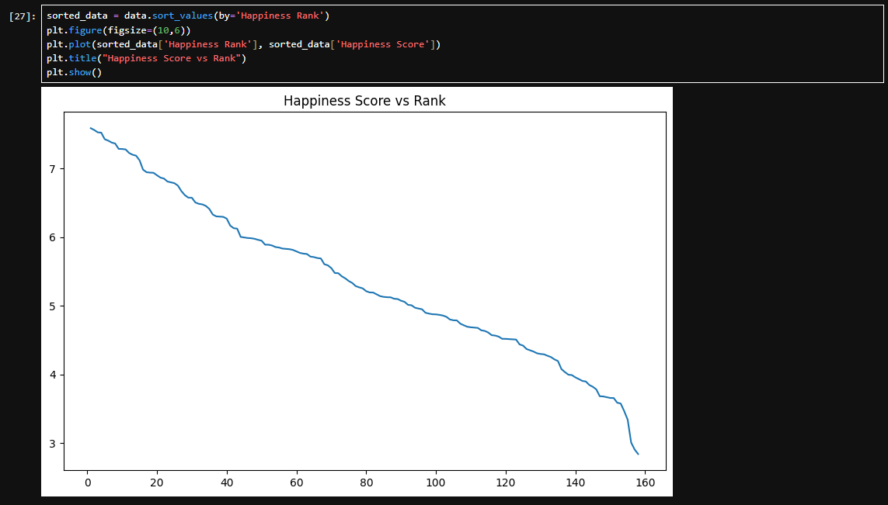
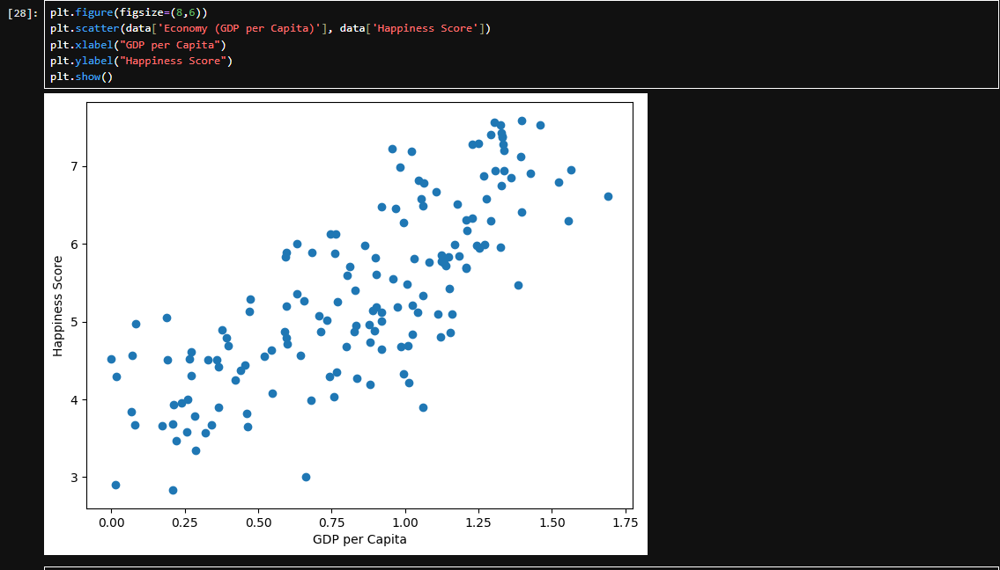
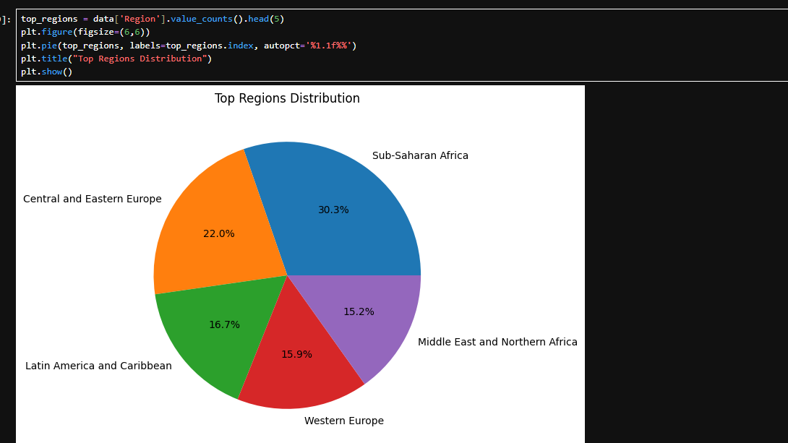
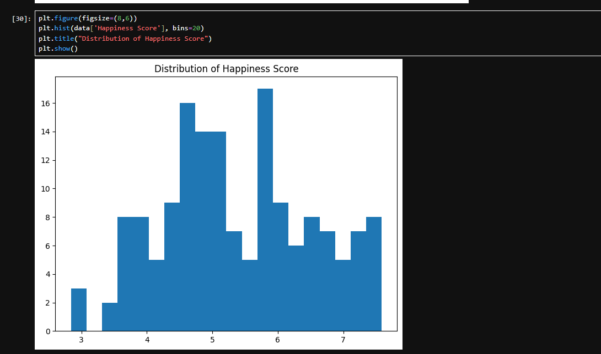

```markdown
# 🌍 World Happiness Data Analysis & Visualization 📊

✨ A Python-based project that explores the **World Happiness Dataset (2015)** and transforms raw data into meaningful insights using powerful visualizations.

---

## 🚀 Features

🔹 Load and explore dataset  
🔹 Data cleaning & preprocessing  
🔹 Handle missing values smartly  
🔹 Statistical analysis (mean, std, etc.)  
🔹 Data visualization using multiple charts 📈  
🔹 Insights from Happiness Score & GDP  

---

## 🛠️ Technologies Used

- 🐍 Python  
- 📦 Pandas  
- 🔢 NumPy  
- 📊 Matplotlib  
- 🎨 Seaborn  

---

## 📂 Project Structure

```

Project9/
│── Screenshots/
│   ├── s1.png
│   ├── s2.png
│   ├── s3.png
│   ├── s4.png
│   ├── s5.png
│   ├── s6.png
│   ├── s7.png
│   ├── s8.png
│   ├── s9.png
│
│── 2015.csv
│── FinalProject.ipynb
│── README.md

```

---

## ▶️ How to Run

1️⃣ Open VS Code / Jupyter Notebook  
2️⃣ Open `FinalProject.ipynb`  
3️⃣ Run cells one by one  

---

## 🧠 Steps Performed

✔️ Import libraries  
✔️ Load dataset  
✔️ Explore data (`head`, `info`, `describe`)  
✔️ Handle missing values  
✔️ Remove duplicates  
✔️ Convert data types  
✔️ Perform sorting & grouping  
✔️ Create visualizations  

---

## 📊 Visualizations Included

📌 Top 10 Happiest Countries (Bar Chart)  
📌 Average Happiness by Region  
📌 Happiness Score vs Rank (Line Plot)  
📌 GDP vs Happiness Score (Scatter Plot)  
📌 Region Distribution (Pie Chart)  
📌 Happiness Score Distribution (Histogram)  

---

## 📸 Screenshots

### 🔹 Dataset Preview


### 🔹 Data Info


### 🔹 Statistical Summary


### 🔹 Missing Values


### 🔹 Data Cleaning Code


### 🔹 Top 10 Happiest Countries


### 🔹 Average Happiness by Region


### 🔹 Happiness Score vs Rank


### 🔹 GDP vs Happiness (Scatter)


---

## 📈 Key Insights

✨ Countries with higher GDP tend to have higher happiness scores  
✨ Western Europe dominates top happiness rankings  
✨ Strong correlation between economy and happiness  
✨ Distribution shows most countries fall in mid happiness range  

---

## 🎯 Purpose of Project

✔️ Understand real-world dataset analysis  
✔️ Learn data cleaning techniques  
✔️ Practice visualization skills  
✔️ Build strong Python + Pandas foundation  

---

## 🔮 Future Improvements

✨ Add interactive dashboards (Plotly / Streamlit)  
✨ Compare multiple years  
✨ Machine learning predictions 🤖  
✨ Web-based UI  

---

## 🙌 Conclusion

This project demonstrates how raw data can be transformed into **clear insights and visual stories** using Python.

---

